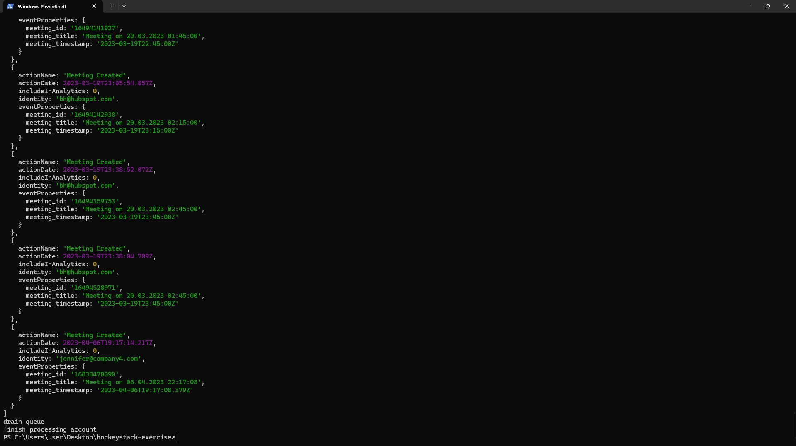

## Output

## Debrief
1. Code Quality and Readability
    - Decluttering the worker.js file and making controllers for different controllers (not a controller for each function, just categorizing them would be fine) would make wonders for this project.
    Also storing repetitive HubSpot API endpoints or texts could be stored in a seperate json file would be nice, but dynamic links containing query params would cause an issue.

2. Architecture
    - This project currently uses `"@hubspot/api-client": "^8.5.0",` and the latest version of the package is `13.0.0` which is published 16 days ago. 
    The new version has better handling of the meetings API. It has caused significant misunderstandings on my end. 
    Another aspect to consider is the option of other backend frameworks and TypeScript. The type-safety features and better performance can be achieved through various frameworks.

3. Code Performance
    - Parallelizing independent tasks would significantly improve the performance. Current code sequentially calls processContacts, processCompanies, and processMeetings, although they are independent.
    Another thing to consider is the retry logic. If HubSpot API is under load, the current code might get rate-limited or 500 errors. Detecting rate-limits and using `p-retry` or `axios-retry` would make errors easier to handle.
    Finally, the current code calls `domain.save()` after each processing function. Even though it didn't effect the code I ran (because it is disabled), in production it would effect the performance. Calling `domain.save()` once would be enough.  

# flextzius